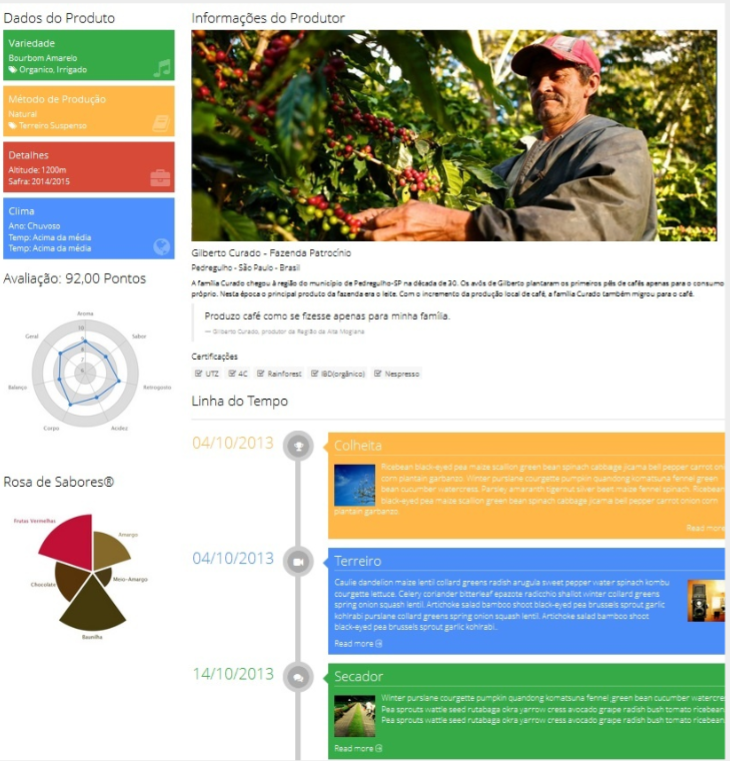
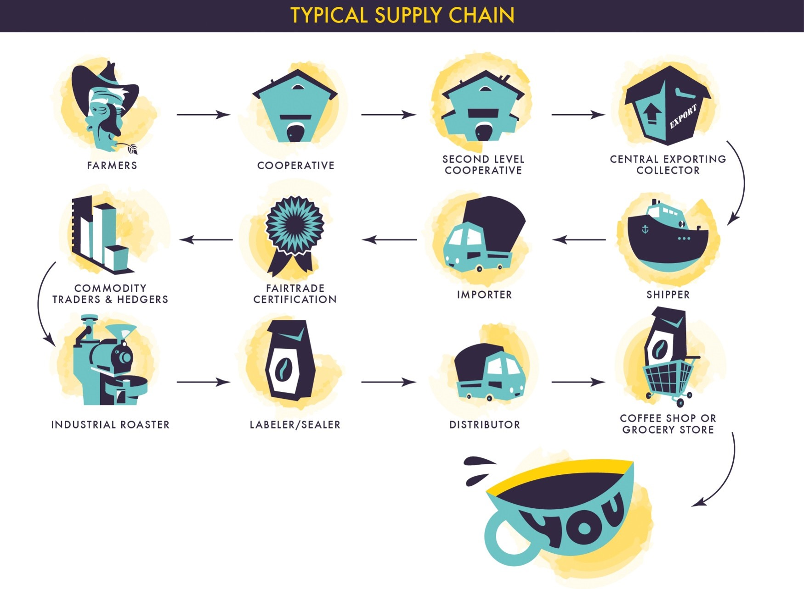
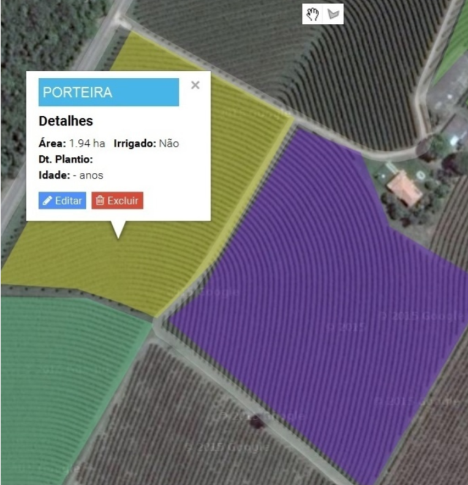
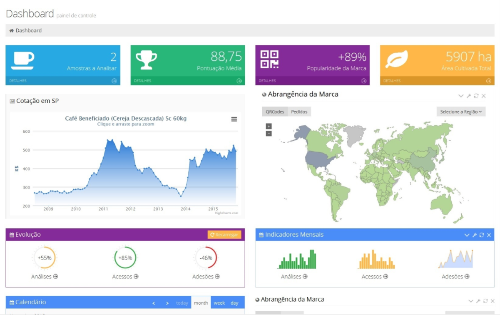
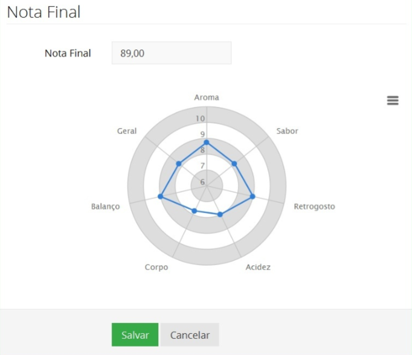
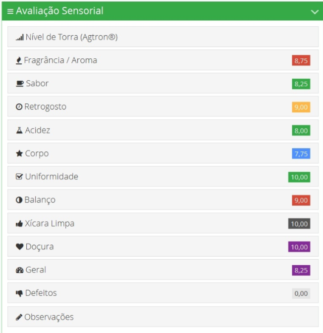
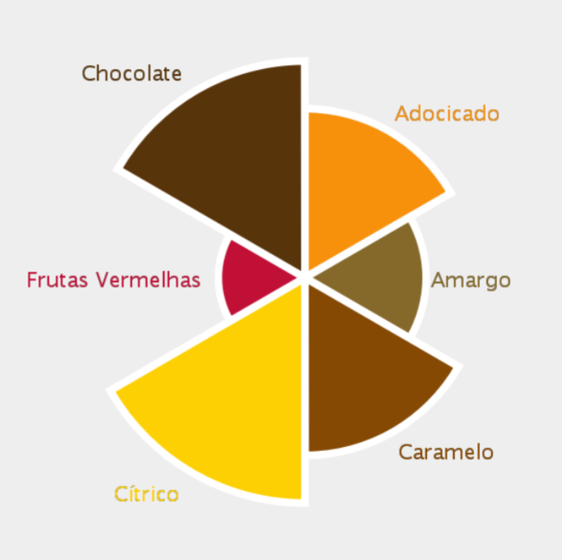

# Specialty Coffee Production and Traceability Platform

Specialty Coffee Production and Traceability Platform is a comprehensive tool for managing all phases of coffee production, from georeferenced field mapping with terrain slope and sun orientation data to tracking daily agrometeorological data. Our platform also offers features like sequential water balance calculations, coffee classification according to the SCAA protocol, and support for quality contests with mobile device compatibility.

## Why traceability matters to consummers?
Strong attractiveness and demand for sustainable products with guaranteed quality and origin.
No more advertising claims (gourmet, premium, coffeehouse-style, etc.)
Shows transparency to the consumer and tells an authentic story about a high-quality product.
Consumers are actively seeking authentic experiences. This includes not only the coffee's flavour but also its story. Coffee becomes an emotional experience.
Perception of peculiarity that translates into extra earnings.
Consumers indoctrinated into seasonality, vintage, origin, competitions. The world of coffee becomes intimate and personal.

## Why traceability matters to farmers?
Adding value to the product.
Recording of crop management and weather events.
Strengthening the brand (individual and collective).
Facilitates obtaining certifications.
Enables the Experiment - Discovery - Replication cycle.
Promotes communication and synergy in the production chain.

## Technical Characteristics
- Multiplatform
- Mobile first
- 24/7/365 availability
- Scalability 
- Cloud ready
- Modular
- Georeferencing
- Adherence to legislation
- Focus in Agrometeorology
- Focus in Sustainability
- Internationalization support
- Traceability and chain of custody

## Features

### Coffee cooperative Management
- Members management
- Registration of properties
- monthly fees management 
- Payment control
- Contact througt Sending sms / email
- Calendar and internal communication
- Providing services to members

### Georeferenced Field Mapping
- Create and manage field plots with georeferenced data.
- Record terrain slope and sun orientation information.
- Plan your coffee planting strategies with precision.

### Management of Coffee Production
- Efficiently record all management activities carried out in your coffee fields.
- Keep a log of tasks and interventions, ensuring better crop management.

### Agrometeorological Data
- Data from public stations: Public meteorological stations, micro-stations on properties, TRMM, SMAP.
- Water balance / irrigation
- Crop management conditions
- Fertilization recommendation based on soil analysis
- Weather forecast
- Yield estimation
- Disease alert 
- Frost warning
- Rational use of resources
- Soil conservation
- Daily recording of agrometeorological data for improved decision-making.
- Monitor weather conditions to make informed choices during the cultivation process.
- Management Conditions forecast

### Sequential Water Balance
- Calculate the sequential water balance of your coffee crops.
- Ensure optimal water management throughout the cultivation cycle.

### Coffee Classification (SCAA Protocol)
- Utilize our exclusive module to classify coffee beans according to the SCAA protocol.
- Maintain quality standards and ensure consistency in coffee grading.

### Quality Contests (SCAA Protocol)
- SCAA cupping protocol
- Internet registration
- Multiple categories
- Pre-selection and selection phases 
- Official judges and observers
- Remote voting via mobile devices
- Anonymity via qr code
- Real-time audit
- Instant results
- Exclusive rose of flavours
- Results integrated with lot traceability

### Exclusive Rose of Flavours
- Visual flavor identification
- Simplified nomenclature
- Highlights the predominance of each flavor
- Search and filter by flavor
- Statistics operations with flavors values

### Traceability and Chain of Custody
- Guarantee of Origin and Quality.
- Complies with the Technical Regulation on Identity and Quality for the Classification of Raw Bean Processed Coffee.
- Sustainability of the Production Process.
- Record of coffee history throughout the chain.
- Consumers looking for experiences beyond the flavour of the coffee.
- Chain of Custody.
- Adding value to the traced product.
- Identification of success factors and replication of processes.
- Exclusive Rose of Flavours®.

## Getting Started

To get started with our platform, please visit [YourPlatformURL](https://www.yourplatform.com) and sign up for an account. We offer extensive documentation and support to help you make the most of our features.
Prezi presentation: https://prezi.com/view/t7RAX5TOMPJehDvBL7sk/

## Contributing

We welcome contributions from the open-source community. If you have ideas for improvements or bug fixes, please contact me.

## License

This project is licensed under the [Your License Name](LICENSE).

## Contact Us

If you have any questions or need support, feel free to reach out to us by e-mail [Wesley McAndrews](mailto:wesley@mcandrews.com.br).

Thank you for choosing our Specialty Coffee Production and Traceability Platform. We are excited to be part of your coffee journey.

Happy Brewing! ☕
